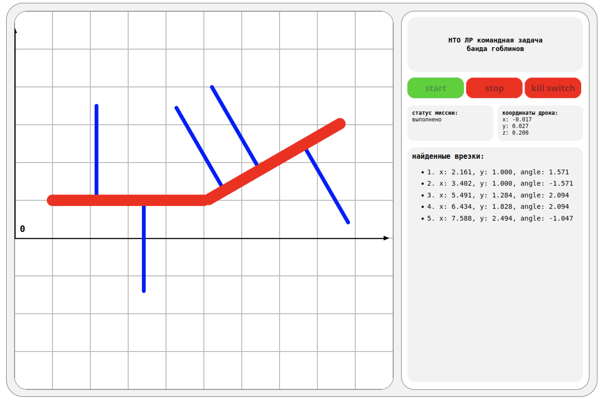

# NTO-Banda-Goblinov

| Поле    | Значение               |
| ------- | ---------------------- |
| Трек    | Летающая робототехника |
| Задание | Командное задание      |
| Тип     | Инструкция (README)    |
| Команда | Банда гоблинов         |

| Участник           | Роль                    |
| ------------------ | ----------------------- |
| • Елисей Шибаев    | Капитан, инженер-техник |
| • Демьян Тарасов   | Инженер-программист     |
| • Тарас Резниченко | Программист             |
| • Михаил Ношин     | Программист             |
| • Ирина Урих       | Наставник               |

---

## Содержание

1. [Описание задачи](#1-описание-задачи)  
2. [Состав репозитория и материалы](#2-состав-репозитория-и-материалы)  
3. [Установка виртуальной машины](#3-установка-виртуальной-машины)  
4. [Настройка симулятора и генерация мира](#4-настройка-симулятора-и-генерация-мира)  
5. [Полётная миссия](#5-полётная-миссия)  
6. [Веб-приложение](#6-веб-приложение)  
7. [Вклад участников](#7-вклад-участников)  

---

## 1. Описание задачи

Проект реализует систему мониторинга нефтепровода на базе квадрокоптера **Clover** в симуляторе **Gazebo** под управлением **ROS**.  
Цель — автоматизировать поиск врезок (ответвлений) в основную трубу нефтепровода.

Основные требования:

- один раз взлететь;
- выполнить полёт вдоль трубопровода;
- определить координаты всех врезок в системе координат `aruco_map`;
- записать результаты в ROS-топик `/tubes`;
- отобразить найденные врезки в веб-интерфейсе.

---

## 2. Состав репозитория и материалы

В репозитории находятся:

- `README.md` — текущий файл с пошаговой инструкцией по запуску проекта;
- исходный код всех скриптов, разбитый по смысловым папкам и снабжённый комментариями:
  - полётная логика (`drone`);
  - генерация и настройка мира (`config`);
  - веб-сервер и фронтенд (`front`);
- вспомогательные файлы мира для симулятора.

Дополнительно записан видеоролик прохождения миссии, на котором одновременно видны:

- порядок установки
- окно симулятора;
- терминал с запуском кода и выводом топика `/tubes`;
- веб-интерфейс управления миссией и отображением врезок.

---

## 3. Установка виртуальной машины

Для работы проекта используется виртуальная машина Clover с преднастроенным симулятором Gazebo и ROS. В качестве ПО для виртуализации можно использовать VirtualBox, VMware Player или VMware Workstation. Мы используем VMware Workstation Pro, его рекомендуем к установке.

1. Установите ПО для виртуализации.
2. Перейдите по ссылке на релиз виртуальной машины Clover и скачайте образ:
   [Release v1.4 · CopterExpress/clover_vm](https://github.com/CopterExpress/clover_vm/releases/tag/v1.4)
3. Откройте установленное ПО для виртуализации и выберите пункт `File -> Open` (или сочетание клавиш `CTRL+O`), затем укажите скачанный файл образа `clover-devel_v1.4.ova`.
4. При импорте задайте имя виртуальной машины, например `Clover`.
5. После создания ВМ откройте её настройки:
   - `Memory`: выделите не менее половины доступной оперативной памяти хост‑системы (например, 8–12 ГБ при наличии 16 ГБ ОЗУ, чтобы ускорить работу симуляции).
   - `Processors`: установите 1 виртуальный процессор и 3 ядра (параметр `Number of cores per processor`).
   - `Network Adapter`: выберите тип соединения `NAT: Used to share the host's IP address` и установите флажок `Connect at power on`.
   Остальные параметры можно оставить по умолчанию. Нажмите `OK`, чтобы сохранить настройки.

---

## 4. Настройка симулятора и генерация мира

После первого запуска **Clover** необходимо подготовить окружение под задачу мониторинга нефтепровода.

### Установка необходимых модулей

Внутри виртуальной машины откройте терминал и введите:

```bash
pip install Flask==2.2.2 Flask-SocketIO
```

### Клонирование репозитория

Для клонирования проекта на рабочий стол в новом окне терминала введите:

```bash
cd ~/Desktop
git clone https://github.com/krisikas/NTO-Banda-Goblinov.git
```

### Базовая конфигурация мира

Из папки `config` запустите файл конфигурации, который настраивает мир и параметры симуляции:

```bash
cd ~/Desktop/NTO-Banda-Goblinov
python3 config/config.py
```

### Генерация трубопровода

Из папки `config` запустите файл генерации конфигурацию трубопровода (основная труба + врезки):

```bash
cd ~/Desktop/NTO-Banda-Goblinov
python3 config/gen_tubes.py
```

Пример вывода скрипта:

```
[gen_tubes] 1, pos:2.170 1.000, turn:1.571
[gen_tubes] 2, pos:3.390 1.000, turn:-1.571
[gen_tubes] 3, pos:5.459 1.265, turn:2.094
[gen_tubes] 4, pos:6.455 1.840, turn:2.094
[gen_tubes] 5, pos:7.555 2.475, turn:-1.047
```

После этого в Gazebo будет подготовлен мир с нефтепроводом и врезками, и можно переходить к запуску полётной миссии.
Пример расстановки труб:


---

## 5. Полётная миссия

Полёт вдоль нефтепровода и поиск врезок реализованы в папке `drone`. Главная точка входа — файл `main.py`.

### Структура кода

- **`drone/deps.py`** — класс `CloverDeps`:
  - инициализация ROS-сервисов (`navigate`, `get_telemetry`, `land`, `arming`);
  - создание `CvBridge` для конвертации изображений;
  - задание границ HSV для цветовой фильтрации труб.
- **`drone/functions.py`** — вспомогательные функции:
  - `navigate_wait()` — обёртка над навигацией с ожиданием достижения целевой точки;
  - `proj_point()` — проекция точки на отрезок (для вычисления координат врезок).
  - `check_cmd()` — проверка получения новой команды.
- **`drone/part.py`** — функция `part()` для сканирования участка трубы:
  - получение изображений с камеры,
  - обработка в OpenCV (HSV, маски, контуры),
  - поиск врезок и добавление их координат в массив.
- **`drone/main.py`** — главный сценарий миссии:
  - взлёт, облет труб, сбор координат врезок, возврат и посадка.

### Логика миссии

- Последовательно облетает **две части** основной трубы нефтепровода,
- В реальном времени получает изображение с камеры, обрабатывает его с помощью **OpenCV**,
- По площади и положению контуров определяется место пересечения врезки с основной трубой,
- Для каждой врезки вычисляются:
  - координаты точки пересечения (`x`, `y` в `aruco_map`);
  - угол отхода врезки.

Данные публикуются в топик `/tubes` в формате:

```
[{"x": float, "y": float, "angle": float}, ...]
```

По завершении сканирования:

- дрон возвращается в стартовую точку,
- выполняет посадку,

Во время выполнения миссии возможна приостановка и продолжение выполнения по команде с веб-интерфейса

### Запуск полётной миссии

1. Запустите Gazebo
2. Откройте новое окно терминал
3. Введите следующую команду:

```bash
cd ~/Desktop/NTO-Banda-Goblinov
python3 drone/main.py
```
После этого дрон будет ожидать команды старта от веб-интерфейса. Как его запустить далее.

---

## 6. Веб-приложение

### Структура кода

- **Фронтенд**
  - HTML + JavaScript (клиент Socket.IO),
  - 2D-карта трубопровода,
  - кнопки управления миссией,
  - отображение статуса и координат.
  
- **Бэкенд**
  - Flask + сервер Socket.IO,
  - обработка REST API-запросов:
   - `GET /api/start` — отправка команды `start`;
   - `GET /api/stop` — отправка команды `stop`;
   - `GET /api/kill` — отправка команды `kill`.
  - организация WebSocket-соединения с фронтендом.

- **Связь с дроном**
  - Бэкенд транслирует от фортенда и получает от дрона данные через ROS-топики `/tubes`, `/status`, `/cmd`.

Схема обмена данными:

```
HTML (Фронтенд) <=> REST API + WebSocket <=> Flask (Бэкенд) <=> ROS-топики <=> Дрон
```

### Функционал интерфейса

Интерфейс веб-приложения включает:

1. **Статус миссии**  
   Отображение текущего состояния:
   - «выполняется»;
   - «остановлено»;
   - «аварийная остановка»;
   - «выполнено».

2. **Кнопки управления**
   - **Start** — запуск/возобновление миссии;
   - **Stop** — запрос приостановки и посадки (дрон отлетает в сторону и садится);
   - **Kill switch** — аварийное завершение.

3. **Карта трубопровода**
   - 2D-сетка, где ячейка 100×100 пикселей соответствует 1 метру;
   - основная труба отображается как линия;
   - врезки выделяются на карте по мере обнаружения.
   
4. **Телеметрия дрона**
   - текущие координаты  `x`, `y`, `z` в системе `aruco_map`, обновляемые в реальном времени.

3. **Найденные врезки**
   - список с координатами и углами для каждой врезки.
   - графическое отображение положения врезок

### Запуск веб-приложения
1. Откройте новое окно терминал
2. Введите следующую команду:

```bash
cd ~/Desktop/NTO-Banda-Goblinov
python3 front/main.py
```

3. Откройте браузер **внутри виртуальной машины** и перейдите по адресу:

```text
http://localhost:5000/
```




> Если интерфейс не помещается на экран, уменьшите масштаб (`Ctrl` + `-`) или разверните окно браузера.  
> `Ctrl` + `+` — увеличить, `Ctrl` + `0` — сбросить к стандартному масштабу.

> Полная остановка кода веб интерфейса осуществляется через закрытие окна терминал.

---

## 7. Вклад участников

| Участник             | Роль                    | Вклад                                                                                                                                                                                                                               |
| -------------------- | ----------------------- | ----------------------------------------------------------------------------------------------------------------------------------------------------------------------------------------------------------------------------------- |
| **Елисей Шибаев**    | Капитан, инженер-техник | Распределение командных задач, создание 3Д моделей для генерации среды. Сбор информации для успешного написания программного кода. Отслеживание выполнения критериев, написание инструкции (документации) приложенной к работе.     |
| **Демьян Тарасов**   | Инженер-программист     | Написание Backend части программного кода, отвечающего за полный полет дрона вдоль основной трубы, а также обнаружения врезок, сбор считанных данных и публикация их в топики.                                                      |
| **Тарас Резниченко** | Программист             | Написание Backend части программного кода, подготовка среды, использования текстурных 3Д моделей, создание системы случайной генерации врезок в главную трубу.                                                                      |
| **Михаил Ношин**     | Программист             | Написание Frontend части программного кода, создание веб-интерфейса, который в свою очередь отображает найденные врезки в реальном времени. Считывание данных с топиков, публикациях их на страницу.                                |
| **Ирина Урих**       | Наставник               | Изучение приложенного материала для выполнение задач 2 этапа, объяснение трудного материала. Выстраивание осмысленной и целенаправленной стратегии подготовки участников. Отзывчивость и помощь в случае возникновения затруднений. |

Команда работала слаженно и ответственно, каждый участник являлся полезным звеном и не выбивался из рабочего процесса. Выполнял поставленные перед ним задачи, помогал остальным участникам команды.

